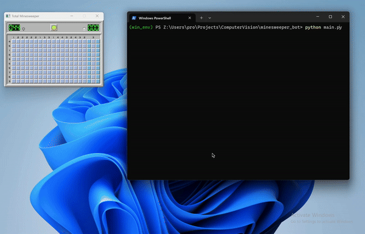

# Windows Minesweeper automation bot



You can use this python program for Windows minesweeper game automation. The win rate is 70%

## Features

- OpenCV in game objects detection.
- You can automate most of minesweeper games by updating config.py file. Just change <u>object_hex_color</u> which is using for object detections. Also you may need to update <u>min_area</u> and <u>max_area</u> configs. They are using for object filtering in case of same objects color in game UI.
- Clicks automation.

## Requirements

- Python 3.8+
- Windows OS.

## Installation

1. Clone this repository:
   ```bash
   git clone https://github.com/AlexanderTsk/minesweeper_bot.git
   cd minesweeper_bot

2. Install dependencies:
   ```bash
   pip install -r requirements.txt

## Usage 
1. Open the Minesweeper game

2. Run command:
   ```bash
   python main.py 

3. Choose the Minesweeper game window title from your Terminal
